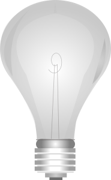

# Semester Project
> The goal of this project is to create a website that a user can easily access from any device to toggle the lights connected to a Raspberry PI. To achieve our goal, a relay is used to connect the Raspberry PI and the light acting as a switch. 

## Demo

[](https://www.youtube.com/watch?v=1YRh6HXmCNM)

## Setup

### Hardware Components

* Raspberry Pi
* Relay
* Lights

### Dependencies

* Python
* RPi.GPIO
* Flask

The following command is run on the Pi to install these dependencies:
```
sudo apt-get install -r requirements.txt
```

The Pi acts as a server, using Flask to serve the web page of the project. The biggest advantage of Flask is the separation of front and back-end code, allowing our group to work on files separately. The main python file contains the actual process that powers on the switch, while the files in the templates folder include the layout and styling of the web page.

The RPi.GPIO library allow us to manipulate the GPIO channels on the board, the channel is used to trigger the relay allowing the current to flow to the light.  These functions toggle the switch:
```python
# Power on
GPIO.output (relay_pin, GPIO.LOW)
# Power off
GPIO.output (relay_pin, GPIO.HIGH)
```
The state of the light and changes whenever one of the commands are called. Flask tracks this state and changes the view depending on its status (on or off). 

### Files

* app.py
* header.html
* lights.html

app.py sets up the back-end by including the libraries and setting the routes for each status. The default route checks the current status of the light and renders the matching template. The status routes contains the functions for toggling the light as well as setting the value of the pin at once. This allows the web page to update its view dynamically

```python
@app.route("/<status>")
def onAction(status):
	pin = 2
	if status == "on":
		pin = 0
		GPIO.output (relay_pin, GPIO.LOW)
		print ("on")
	if status == "off":
		pin = 1
		GPIO.output (relay_pin, GPIO.HIGH)
		print ("off")
	
	# return to the template with new info
	return render_template ('lights.html',pin=pin)
```

header.html contains the styling and layout of the web page such as the navigation bar and style. By extending this file, a file will inherit the style properties and all existing elements. 

lights.html extends the header file, and includes a block containing the code for the actual button that powers on the light. The view depends on the pin state sent by app.py as shown:

```html
<!-- check pin state -->

</p>
<br></br>
<input class="button is-info is-large" type="button" onclick="window.location='/on';" value="Turn on"/ id="lighton">

</p>
<br></br>
<input class="button is-center is-info is-large" type="button" onclick="window.location='/off';" value="Turn off"/ id="lightoff">

```

## Issues

### Open

#### [Connection](https://github.com/dosterz97/zephyr/issues/14)

Our main issue was that the if we wanted to use AWS IoT things to have more complex features... Like remembering whether the light was on or not, the raspberry pi was also required to download the software so the persisting "shadow devices" could exist and their state would be changed even if the light wasn't connected.

The connection type is a major problem with the current setup we have. When using some large pulic networks the IP adress of the pi can get very complicated making it very difficult to connect to the page hosted by the pi. When we were trying to test the setup outside of a small network we had to use a hotspot to get connection to the pi and the IP that was given to the pi was so complex that is was more difficult than it was worth to connect to the pi.

#### [Light Variety](https://github.com/dosterz97/zephyr/issues/8)

The current system only allows for toggling the power of a through hole LED. Our other option is a Phillips Hue that might be able to connect to the Pi wirelessly.

### Closed

#### [UI](https://github.com/dosterz97/zephyr/issues/3)

The webpage needed a neat design and a way to indicate the status of the light. Bulma was included to apply a neat look to the site and an image of a lightbulb is and updated when a change occurs.

## History

### Sprint 3
> After initial implementation of the program, we created a typical use case scenario as well as an example persona and created a list of issues that needed to be worked on for Sprint 4. This allowed to focus on specific issues and work on them one by one.

#### Persona of an average user

The lights use case in general, is a very impersonal experience. But given that such a wide variety of users exist, it is important to recognize that we must make our product the most widely available and useable to the most amount of people. Unless people prefer to go around lighting their own candles one by one, they would prefer to use our product which would allow them to turn off lights without having to walk around their entire home. But more specifically, tech guru's who like to control many of the aspects of their home from their mobile device, can add and remove lights remotely, and as the technology we are building expands into more features, things like room aestetic, light patterns, and A.I. can help inhance the product giving it more use than just an on/off switch connected through your phone. As the use case exists in it's most simple form, the technology is the equivelant of a digital light switch, which for all purposes can be used by a basic user to control their lights.

The general user workflow will be to connect to the host webpage, which should have user authentication, then they will have access to their connected devices (in this case lights). For the lights they will be ableto turn them on and off from the webpage. Eventually they should be able to also change the color and brightness of their lights. Another side case is that light pairing should be easy enough so that a basic user can easily add and remove new lights from the system.

#### Expectations

After having a very productive work day on 04/30: https://docs.google.com/document/d/1Ru4Gy9MB1GTsTj8Ja4p33Uhs-5mwDKdjPwpoWv5L_aM/edit?usp=sharing

Also on May 2nd Dylan and Zach got together in the Linux lab and started working on the ec2 configuration files by looking into the AWS documentation while Jon continued work on the Flask files. However as he was remote and we only have one raspberrypi it has yet to be tested on the environment. The local version of the product should theoretically be finished but needs to be tested along with it to be hosted on our ec2 instance. For more information on the final product vision read below.

We have finalized on what our goal for the final product is. As taken under advisement by Proffesor Groggins, authentication won't be a priority in the final product. Instead we will be focusing on getting a flask application hosted on an ec2 instance that anyone can access to change the status of the light bulb. This is one scentence is our final minimum viable product for the project. But as this should be more than accomplishable in our current time frame, our goal is to add either rgb capabilites and/or brightness capabilites. Other extenstions as time-based automatic command fired by the instance were also take under consideration (I.e. turning the light on at 8am!) but as time constraints exist, not everything can make the cut in the short timeframe. 

The main technical challenge will be connecting an ec2 instance over a network to a rasberrypi, as local development is already working seamlessly at the moment. Our goal for the end user is to be able to access the site without having to run ANY commands to boot up the instance and all they need to do to test/use the light is to flip the switch. So in this frame we can handle the installation and booting up of the system so there is no need for extensive user education on how to use or setup the experience.

### Sprint 2
> Having no experience with hardware, we faced many challenges such as figuring out how we wanted to implement our ideas. The Raspberry Pi became the focus and was decided to be the board running our home system as it allows us to connect and control hardware such as light bulbs to it.

#### Sprint 1 Summary of Progress

To summarize what is below and the current status of our project: we have pivoted to change the size of scope of our project from multiple use cases using the zephry system, to focusing on one specific use case, the light use case. We already ordered hardware and have hooked up the wiring from the light and the relay. However the current relay doesn't have enough power to switch off the light because the GPIO pins only output 3.3v and not the 5v needed to affect the ciruit. The new relay should be in soon and should unblock us and allow us to continue to test the components. Once we have tested the components, (idealy this thrusday) we will be able to start writing the relay code needed to interface with the light. Once we get the basic use case working then we can futher develop the feature by implement colors, patterns, and brightness.

#### Sprint 1 Issues

Many ideas were created during Spring 1 of this project. Our group developed three use cases for the Home Automation Zephyr Project: TV Time Restriction, Front Door Monitoring, and Lights Adjustment.  Our first "pass" from the previous sprint involved a Django server to host the databases required but the scope proved to be too big as we are limited by the time remaining to implement all of our use cases given we do not have experience with hardware and coding in Python. We ultimately decided to implement the Lights Adjustment use case for this Sprint.

The next objective therefore is to create a simple application that changes the confirguration of a light, accessible from any browser. Our options included emulating the system in a web application by using the *states* a light can take and displaying the output of what the room might look like. The other is to use a Raspberry PI and relay switch to control a light remotely.

#### Light Configuration

For our light configuration we are going to be using _blank_. This model will allow us to use *flask* on a *raspberry pi* to communicate with the light. We will still be able to use our python stubed out from our old plan for most of the use case. But after that, setups for testing will be minimal as we will have the connection hosted through a server so the users only have to visit the website.

#### Hardware Components

* Raspberry Pi
* Relay
* Lights

To achieve our goal, a relay is used to connect the Raspberry PI and the light. It acts as a switch and could be toggled simply by running the commands:

```python
#on
GPIO.output (relay_pin, GPIO.LOW)
#off
GPIO.output (relay_pin, GPIO.HIGH)
```
#### Hardware Challenges

We did run into one roadblock with the hardware we chose. The relay connected to our raspberry pi needs 5 volts to trigger the switch , but the GPIO pins output a max of 3.3 volts. We have ordered a different type of relay that has a lower range of activation to fix this issue. There are other ways to bypass this like making a small amplifying circuit with transistors to boost the voltage and current to the needed levels to activate the relay. 

#### Necessary Libraries

The GPIO channels library is installed with the following command

```
sudo apt-get install python-rpi.gpio
```

This will allow us to manipulate the GPIO channels on the board, the channel is used to trigger the relay allowing the current to flow to the light.

#### Virtual Environment

Everything is created in a Python virtual environment to keep everything separated

```sh
sudo apt-get install python-virtualenv
mkdir lightsApp
cd lightsApp

#activate the virtual environment
virtualenv lightsEnv
lightsEnv/bin/activate

#install required library (Flask web framework) on virtual environment
pip install flask uwsgi rpi.gpio
```

#### Functionality

This code sets up the relay connections and listens for commands. 

```python
#WIP - need to work on code for turning on lights

from flask import Flask, render_template
import RPi.GPIO as GPIO
 
app = Flask(__name__)
 
#pin connected to relay
#pin state

#GPIO set up
 
#default route, without anything
# set routes for actions: on and off
	
# return to the template with new info
```

#### Front-end

Flask provides the framework for the web application and Nginx is the web server used to host it.

#### lightsApp.html

This is the main index file containing the elements of the web application. It is currently a button that changes dynamically based on the current setting.

```html
#WIP - working on html. 

<html>
<body>
	
	<!-- header.html includes head and stylesheet references. Needs to be worked on -->
	
        <script type="text/javascript">
                $(function() {
                        $('#on').click(function() {
                                $('#slider').attr("src","static/images/on.png");
                        
                        });
                        $('#off').click(function() {
                                $('#slider').attr("src","static/images/off.png");
                        });
                });
        </script>
        <div class="container"> 
                <div class="row">
                        <div class="two-thirds columns">
                                <h1>Lights Adjustment</h1>
       				<!-- check pin state -->
       				
				<!-- If lights are off-->
                		<input type="button" onclick="window.location='/on';" value="Turn on"/>
				
                		<!-- If lights are on-->
                		<input type="button" onclick="window.location='/off';" value="Turn off"/>
        			
                        </div>
                </div>
        </div>
	
        
</body>
</html>
```

#### User Interface Design

Web app sketch: https://github.com/dosterz97/zephyr/blob/master/views/ui_sketch.png

The UI will consist of two sections as shown. The left side of page contains a list of tiles of all the floors of the home. Selecting a tile highlights it and updates the right side, which displays a view of the whole floor from above. Each room is colored based on the state of the light being controlled in the room. Selecting a room will prompt the user to toggle the settings of the light they selected and the page updates as soon as it handles the request.

## Sprint 1
> We created several requirements that we would each work on and include into the home system. Several use cases were created and an initial system was built using Zephyr to build the program and Django to host it. 

### Deployment Environment 
The project is hosted on an EC2 server and can be accessed by the user on an internet connected device. A Raspberry PI controls the system and the hardware associated with it including motion sensors, lights, and a camera. 

### Functional Requirements

#### Adjust Lights
1. The system should control attributes of the lights remotely via user input.
2. The system must update to manual actions done by the user.
3. The system should know what attributes of the lights can be changed.
4. The system should restrict users from lights based off privilege.

#### Front Door Camera
1. The sensor must detect movement.
2. The camera must take a photo of visitor.
3. The database must be updated to have accurate information of the system's status.
4. The users are notified of an event.
5. The users can check the status and view the photo taken by the camera.
6. The user can view a live stream of outside their front door.

### Television Time Restriction
1. The Zephyr system should login users before use.
2. The Zephyr system should log the shows watched.
3. The Zephry system should log the amount of time each show is watched.
4. The Zephry system should handle ending the session gracefully.

### Database Design

#### Full System 
ERD - https://drive.google.com/file/d/1E9FZYTcrmXXyHGFVdGMhGa6XWK0NyF9V/view?usp=sharing

#### Front Door Camera
ERD - https://drive.google.com/file/d/1D54ridRq3nqnebNRgT4SLS5RFa8G-JrE/view

#### Lights Controller
ERD - https://drive.google.com/file/d/1chGReG3twRqIuH7UxfmMHUwRtvx66AjE/view?usp=sharing

#### Television Time Restriction
ERD - https://drive.google.com/file/d/1m5J6BBzVJmYVEjZuhqa1mVOAtMoAqAtq/view?usp=sharing

### Files

#### User Interface Files

#### Front Door UI 
1. A container with the current status of the front door and a thumbnail of the outside view.
2. A table holding previous records that include a timestamp of an event and the corresponding photo taken at the time.

#### Light Control UI
1. Selection menu of the rooms with light connected to the system.
2. When a light is selected options useable by the light will show up to edit.
3. A confirmation window will pop up after the change is sent with either a sucess or error message.

#### Television Time Restriction
1. Login screen for admin (Similar sign up screen)
2. A screen with all connected devices, and all devices trying to pair with the system. 
3. After selecting a device, you can select accounts on the televisions to pull up the restriction page
4. The restrictions page will have different fields that will allow the admin to create different types of rules

### Model Files

#### Front Door Model
1. Photo: A photo is taken and saved along the time it was taken.
2. Status: The status of the front door is recorded and updated for every event.

#### Light Control Model
1. Form layout with the information used to edit the light.
2. current status information of the lights will be stored so the user can see what the current state is before changing.
3. The privilege attached to the account will be checked with before editing the light so an unauthorized user can't change lights they aren't allowed to manipulate.

#### Television Time Restriction
1. Account - Used to keep track of different users and privilege
2. Restriction - Tied weakly to the Accounts they are applied to
3. Television - Tv name and id that are connected to the Zephyr system, so that different restrictions can be put on different devices
4. Show - This model is used by the restrictions for content monitoring (I.e R rated movies not allowed for 12 year olds)

### Controller Files

#### Front Door Controller
1. Sensor functions
* movement_listen(): the system activates actively listens for movement, which triggers the next function.
* activate_camera(): the system proceeds to activate the camera.

2. Camera functions
* sensor_listen(): the camera is only active if the sensor has been activated.
* take_photo(): a photo is taken and saved into the database.
* sleep(): the camera sleeps after a certain amount of time after there is no longer movement detected until awoken again.

3. App functions
* stream_surveillance(): opens a connection between the camera and app to allow the user to see outside the front door.

#### Light Control Controller
1. Edit Functions
* editLight(): The system will apply the recieved for info from the user to the selected light.
* changeColor(): Edits the RGB vaule of the light.
* changeBrightness(): Edits the brightness of the light.
* changeState(): Turns the light on/off.
* editPrivilege(): Lets an Admin change the access to the light.

2. Check Functions
* checkLight(): Gets the current status of the light to update to the server.
* checkColor(): Grabs the RGB vaule of the light.
* checkBrightness(): Grabs the brightness of the light.
* checkState(): Checks if the light is on/off.
* checkPrivilege(): Will check who has access to changing the light.

3. Update Functions
* updateLight(): Will update the status of the light everytime it is changed (Both with app and manually).
* listenLight(): Will check if the light is turned off manually.
* serverConnect(): Will connect the update function to the server to send the values.

4. Error Functions
* failError(): Loads the error message if the edit fails.
* success(): Loads the success message when the light changes successfully.

#### Television Time Restriction
1. Admin Methods
* createAccount(): Creates an account for a userName password etc. This will allow users to login and use the television(s)
* createRestriction(): Creates a restriction that can be reused and applied to multiple accounts
* editAccount(): allows for changing of passwords, permissions, and restrictions.
* editRestriction(): also accessable from the edit account view, used to update fields of the restriction
* viewUsage(): shows analytics of users and the content that were viewing, times of day etc.

2. User Methods
* login(): logs the usres into the account
* changePassword(): if permissions allow, let users change the password for their account

3. Television Methods
* userDidLogin(): starts tracking the data of the user
* userDidLogout(): stops tracking the data of the user
* notifyUser(): if a violation occurs or a time limit is getting reached the zephry system will show the message
* goHome(): if a violation occurs then the television will go back to the home screen 

### Languages

1. Python
* Python is the main language used for this project. Python is used to access the database server and controlling a hardware device.
2. Skill gaps
* Jon: no experience coding in Python
* Everyone: no experience connecting to devices with Bluetooth and hardware in general
* Zach: experience with cmake files and in general larger scale low-level development
* Issue will be integrating and bridging with c code when necessary
3. Django 
* Not a language, but we will use this to for DB and model template


